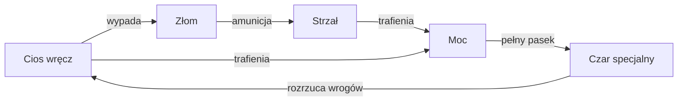
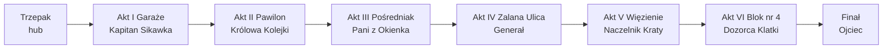

# Osiedle '77: Magia i Sztacheta — Dokument Projektowy

Sep 24, 2026 · @szymon

## 1. Wizja i filary

**Pitch w jednym zdaniu:** 3D roguelike twin-stick, w którym chłopak z bloku w 1977 roku przebija się sztachetą i podwórkową magią przez zmutowane osiedle, żeby w końcu wejść do domu i stanąć naprzeciw pijanego ojca.

**Ukryta prawda gry:** cały ten magiczny, groteskowy świat to wyobraźnia chłopaka, który siedzi nocą na trzepaku i boi się wrócić do domu. Każdy run to jedna próba zebrania odwagi. Śmierć nie jest porażką bohatera, tylko ucieczką z powrotem na trzepak. To uzasadnia pętlę roguelike fabularnie i daje finałowi prawdziwą wagę.

### Filary projektu

Każdy pomysł w grze musi wzmacniać co najmniej jeden filar. Jeśli nie wzmacnia żadnego, wypada.

1. **Niedobór napędza walkę.** Jak w PRL-u, niczego nie ma za dużo. Amunicję do broni dystansowej zdobywasz, bijąc wręcz. Gracz stale przełącza się między zwarciem a dystansem, bo tak działa ekonomia, a nie dlatego, że tak mu kazano.
2. **Absurd z sercem.** Humor celuje w system, dorosłych i realia epoki. Nigdy nie celuje w ofiarę przemocy. Im bliżej bloku nr 4, tym mniej żartów.
3. **Czytelność ponad wszystko.** Szary beton, kolorowa magia. Wszystko, co rani gracza, jest jaskrawe i zapowiedziane (telegraf). Śmierć ma zawsze być winą gracza, nie kamery.
4. **Każdy run opowiada historię.** Losowe ulepszenia łączą się w absurdalne kombinacje (buildy), o których gracz chce opowiedzieć znajomym.

### Dla kogo

- Fani Hades, The Binding of Isaac, Enter the Gungeon i Nuclear Throne.
- Polscy gracze wychowani na Kapitanie Bombie, Misiu i opowieściach rodziców z PRL-u.
- Gracze zagraniczni, dla których PRL jest egzotyczną, świeżą scenerią (jak Rosja w grze Atomic Heart, tylko z humorem i sercem).

### Inspiracje

| Źródło | Co bierzemy |
| --- | --- |
| Hades | Fabuła wpleciona w powtarzanie runów, duety ulepszeń, hub z postaciami |
| Doom Eternal | Pętla zasobów: walka wręcz daje amunicję |
| Enter the Gungeon | Czytelne pociski wrogów, dash z nieśmiertelnością |
| Hotline Miami | Brutalna szybkość, mocny klimat i dźwięk |
| Miś (Bareja) | Absurd biurokracji i codzienności PRL-u |
| Siedem minut po północy | Dziecięca fantazja jako sposób na zmierzenie się z dramatem domowym |

### Parametry

- **Gatunek:** roguelike action, twin-stick shooter/slasher, widok z góry w 3D.
- **Tryb:** tylko dla jednego gracza.
- **Platforma:** PC (Steam), sterowanie mysz + klawiatura, później pad.
- **Silnik:** Unity 6 (URP).
- **Język:** na start tylko polski (głosy, napisy, interfejs). Tłumaczenia ewentualnie po premierze.
- **Tytuł międzynarodowy (na przyszłość):** *Commieblock '77: Spells & Splinters*. "Commieblock" to słowo, którym obcokrajowcy nazywają bloki z wielkiej płyty, a "Splinters" (drzazgi) oddaje sztachetę i brzmi z "Spells" jak rym.
- **Długość:** udany run 45 do 60 minut; pełne ukończenie z odblokowaniami 15 do 25 godzin.

## 2. Świat, ton i fabuła

Akcja dzieje się jednej listopadowej nocy 1977 roku na fikcyjnym Osiedlu Świetlana Przyszłość. Osiedle to wielka płyta, garaże, trzepaki, pawilon handlowy z Dolarexem i Mięsnym oraz blok nr 4, w którym mieszka bohater.

### Bohater

**Kuba, 12 lat.** Nosi ortalionową kurtkę po starszym kuzynie, kluczyk na sznurku i ma wyobraźnię, która zamienia strach w przygodę. Nie mówi dużo. Jego charakter widać w animacjach: przed walką poprawia czapkę, po zwycięstwie zdmuchuje dym z procy jak kowboj z westernu w TV.

### Mama

Mama nie jest damą w opałach czekającą na ratunek. To ona przez lata po cichu chroniła Kubę. W hubie pojawia się jako głos z okna ("Kuba, do domu!") i jako słoiki z przetworami, które zostawia na parapecie piwnicy. Słoiki to najważniejsze ulepszenia stałe. Finał gry to nie "uratowanie" jej, tylko wspólne wyjście.

### Ojciec

W świecie wyobraźni Kuby ojciec rośnie do rozmiarów demona. W rzeczywistości to mały, zniszczony alkoholem człowiek. Gra nigdy nie robi z niego żartu i nigdy nie pokazuje przemocy wobec Mamy wprost, tylko jej ślady: zbitą szklankę, zamknięte drzwi, ciszę w domu.

### Frakcje osiedla

Każda frakcja to przerysowane, dziecięce wyobrażenie dorosłych i instytucji z tamtych lat. Każda ma swoją "szkołę magii" i kolor, co od razu mówi graczowi, czego się spodziewać.

| Frakcja | Kim są w wyobraźni | Magia i kolor |
| --- | --- | --- |
| Menele spod Mięsnego | Magowie ognia i kwasu | Denaturat, fiolet i zieleń |
| Kibice Betonu | Wojownicy szału | Czerwień, amok bojowy |
| Wąchacze Klejoprenu | Szybkie, chwiejne upiory | Kleista żółć, trucizna |
| Milicja i ZOMO | Pancerni rycerze porządku | Błękit, tarcze i gaz |
| Władza Osiedlowa | Dozorcy, aktywiści, kierowniczki | Biurokracja, pieczątki, klątwy |

### Szydercze zamienniki marek

Żadnej prawdziwej marki w grze. Każda dostaje zamiennik, który od razu przypomina oryginał i z niego drwi.

| Zamiennik w grze | Pierwowzór | Żart |
| --- | --- | --- |
| Osiedle Świetlana Przyszłość | typowa nazwa osiedla | Najszarsze miejsce w Polsce z najjaśniejszą nazwą |
| Dolarex | Pewex | Sklep, w którym za złotówki nic nie kupisz |
| Benzopol | CPN | Stacja, na której zawsze "benzyny brak" |
| Unitrąba | Unitra | Radio, które gra tylko jedną stację |
| Kolorowy Sen | telewizor Rubin | Telewizor czarno-biały o kolorowej nazwie |
| Kurdupel 126z | Fiat 126p (Maluch) |  |
| Żuczek | Żuk |  |
| Wichry 3 | rower Wigry 3 |  |
| Klejopren | klej Butapren |  |
| Kiosk Bezruchu | kiosk Ruchu | Kiosk, w którym nic się nie dzieje od 1968 roku |
| Guma Kaczor | guma Donald | Historyjki w papierku są zawsze niedokończone |
| Abibas | Adidas | Klasyczna podróbka z bazaru, tu jako oficjalna marka |
| Dziennik Telewizorny | Dziennik Telewizyjny | Wszystko idzie zgodnie z planem |
| Bazar Szemrany | Bazar Różyckiego |  |
| Klub Beton | kluby piłkarskie epoki | Kibice Betonu, bo "Beton" zawsze wygrywa |

### Akty i zakończenie

1. **Prolog:** Kuba słyszy krzyk z okna i trzask szkła. Ucieka na trzepak. Zamyka oczy i osiedle zaczyna się zmieniać.
2. **Akt I, Garaże:** pierwsze starcia, poznanie zasad świata.
3. **Akt II, Pawilon handlowy:** kolejki, Dolarex, Mięsny, pierwsze ślady tego, co dzieje się w domu.
4. **Akt III, Pośredniak:** urzędowy labirynt w piwnicy pawilonu. Świat dorosłych, w którym nikt nie ma pracy, choć oficjalnie bezrobocia nie ma.
5. **Akt IV, Zalana Ulica:** pęknięta rura ciepłownicza, wojsko, najbardziej widowiskowa bitwa na otwartym terenie.
6. **Akt V, Więzienie:** areszt przy Komendzie. Kuba pierwszy raz widzi, dokąd prowadzi przemoc dorosłych.
7. **Akt VI, Blok nr 4:** klatka schodowa piętro po piętrze, coraz mniej humoru, coraz więcej ciszy.
8. **Finał, Mieszkanie M-3:** najbardziej widowiskowa walka w grze, zakończona śmiercią ojca (opis w sekcji Bossowie).
9. **Epilog:** świt. Kuba i Mama wychodzą z bloku z walizką. Magia znika, osiedle jest znowu zwyczajne i szare, ale pierwszy raz spokojne.

### Jak opowiadamy historię

- Krótkie sceny w hubie między runami, jak w Hades. Każda rozmowa odblokowuje się po konkretnym wydarzeniu w runie.
- **Znajdźki "Pamiątki":** zdjęcia, pocztówki, kartki z zeszytu. Każda to jedno zdanie wspomnienia Kuby. Razem układają się w historię rodziny.
- Bossowie mówią. Każdy ma kilka kwestii zależnych od tego, ile razy gracz już z nim walczył.
- Zero długich przerywników. Fabuła nigdy nie blokuje gracza na dłużej niż 20 sekund.

### Ton, zasada pierwsza

Humor maleje wraz z postępem. Akt I to groteska w stylu Barei. Akt VI to cisza, skrzypiące schody i telewizor zza drzwi sąsiadów. Walka z ojcem nie ma ani jednego żartu. Dzięki temu finał uderza, a epilog przynosi ulgę.

## 3. Postać gracza i sterowanie

Sterowanie jest proste do nauczenia w minutę: ruch, celowanie myszą, dwa ataki, dash i czar. Skok z pierwszego szkicu łączymy z dashem. Dash działa kontekstowo: w otwartym terenie to unik, a po podejściu do murka, skrzyni, maski samochodu czy dachu garażu ten sam przycisk wykonuje skok na podwyższenie. Obiekty do wskoczenia mają jasną krawędź, a gdy postać jest blisko, nad krawędzią pojawia się mała strzałka. Z góry proca zadaje +20% obrażeń, ale wrogowie dystansowi łatwiej tam trafiają.

### Sterowanie

| Akcja | Klawiatura + mysz | Pad | Uwagi |
| --- | --- | --- | --- |
| Ruch | WASD | Lewa gałka | Pełne 8 kierunków, płynnie |
| Celowanie | Mysz | Prawa gałka | Postać zawsze patrzy na kursor |
| Atak dystansowy | LPM (przytrzymaj) | RT | Strzał w biegu, kosztuje Złom |
| Atak wręcz | PPM | RB | Seria do 3 ciosów, daje Złom |
| Dash | Spacja | LT lub A | 0,3 s nieśmiertelności; przy obiekcie do wskoczenia robi skok |
| Czar specjalny | Q | LB | Zużywa pełny pasek Mocy |
| Interakcja | E | X | Drzwi, sklepy, Pamiątki |
| Rzut podręczny | F | Y | Cegła, doniczka, słoik: jednorazowy przedmiot |

### Pętla zasobów (serce walki)

Złom to amunicja broni dystansowej (maks. 30 jednostek na start). Każdy trafiony cios wręcz wybija z wroga 1 do 3 śrubek. Moc ładuje się od każdego trafienia i od uników tuż przed ciosem (perfekcyjny dash daje +15% Mocy). Gracz, który tylko strzela, szybko zostaje bez amunicji. Gracz, który tylko bije, wolniej ładuje czar. Najlepszy styl to rytm: wejdź, uderz, odskocz, strzelaj.

### Statystyki startowe

Wartości do strojenia w testach, ale od nich zaczynamy.

| Statystyka | Wartość | Uwagi |
| --- | --- | --- |
| Zdrowie | 100 | Wyświetlane jako 5 butelek oranżady po 20 |
| Prędkość ruchu | 6 m/s | Bez przyspieszenia, natychmiastowa reakcja |
| Dash: dystans | 4 m | W 0,18 s |
| Dash: odnowienie | 0,8 s | 1 ładunek, ulepszenia dają 2 |
| Dash: nieśmiertelność | 0,3 s | Zgodnie z pierwszym szkicem |
| Złom maks. | 30 |  |
| Moc maks. | 100 | Czar zużywa całość |
| Nieśmiertelność po trafieniu | 0,8 s | Postać miga |

### Kamera

- Perspektywa z góry pod kątem około 50 stopni, stała rotacja (nie obracamy kamery, bo myli celowanie).
- Kamera lekko wyprzedza postać w stronę kursora (do 3 m), dzięki czemu gracz widzi więcej tam, gdzie celuje.
- Celowanie: promień z kursora przecina płaszczyznę na wysokości biodra postaci. Dzięki temu pociski lecą tam, gdzie gracz klika, nawet na schodach.
- Ściany i dachy zasłaniające postać robią się półprzezroczyste.

### Feel, czyli dlaczego walka ma być przyjemna

- **Hit-stop:** gra zamiera na 50 do 80 ms przy mocnym ciosie.
- **Wstrząs ekranu:** mały przy strzale, duży przy wybuchu, z suwakiem w opcjach.
- **Odrzut:** wrogowie wyraźnie lecą do tyłu, sztacheta odpycha najmocniej.
- **Bufor wejścia:** naciśnięcie dasha lub ciosu 0,15 s za wcześnie i tak się wykona.
- **Coyote time przy krawędziach:** 0,1 s, żeby nie spadać przez milimetr.
- **Dźwięk trafienia ważniejszy niż grafika:** każda broń ma swój soczysty dźwięk uderzenia.

## 4. System walki i bronie

Zmiana względem szkicu: bronie nie są liniowymi poziomami (1, 2, 3), tylko osobnymi stylami gry. Liniowe poziomy sprawiają, że stara broń staje się bezużyteczna. Osobne style sprawiają, że każdy run gra się inaczej. Gracz zawsze ma jedną broń białą i jedną dystansową, a nowe znajduje w runie (skrzynki, sklep, nagroda za bossa) i może zamienić.

Każda broń ma też **Ulepszenie Warsztatowe** (do 3 poziomów w runie, płacone Bonami u Pana Zdzisia w garażu). Warsztat zmienia liczby, a ulepszenia roguelike zmieniają zachowanie.

### Bronie białe

| Broń | Styl | Obrażenia / szybkość | Cecha specjalna | Odblokowanie |
| --- | --- | --- | --- | --- |
| Sztacheta z płotu | Ciężki, pewny | 30 / wolna | Mocny odrzut, 3. cios rozbija tarcze | Startowa |
| Tulipan z butelki | Szybki zabójca | 8 / bardzo szybka | Krwawienie, cios w plecy x2 | 150 Kapsli |
| Trzepaczka do dywanów | Kontrola tłumu | 14 / średnia | Szeroki łuk, wybija chmurę kurzu, która oślepia | 200 Kapsli |
| Łańcuch od Wichry 3 | Zasięg | 12 / średnia | Uderza na 3,5 m, przyciąga lekkich wrogów | 250 Kapsli |
| Łom Radziecki | Magiczny ciężki | 40 / bardzo wolna | 25% szansy na porażenie prądem, przytrzymanie = uderzenie w ziemię | Pokonanie Generała |
| Stempel Urzędowy | Biurokrata | 18 / średnia | 3 trafienia w tego samego wroga = pieczątka ZATWIERDZONO i wybuch obszarowy | Pokonanie Pani z Okienka |

### Bronie dystansowe i magiczne

| Broń | Styl | Koszt Złomu | Cecha specjalna | Odblokowanie |
| --- | --- | --- | --- | --- |
| Proca na śruby | Precyzyjna | 1 na strzał | Szybka seria, pocisk odbija się raz od ściany | Startowa |
| Czar PRL-u (butelka z denaturatem) | Obszarowa | 3 na rzut | Lot łukiem nad przeszkodami, plama ognia na 4 s | 150 Kapsli |
| Syfon do wody sodowej | Kontrola | 1 na 0,5 s strumienia | Przemacza i odpycha, ładowanie nabojem CO2 | 200 Kapsli |
| Pistolet na kapiszony | Wybuchowa | 2 na strzał | Każdy strzał to mała eksplozja, rani też gracza z bliska | 250 Kapsli |
| Kineskop Kolorowy Sen | Laser ciągły | 1 na 0,2 s | Przebija wszystko w linii, przegrzewa się po 3 s | Pokonanie Królowej Kolejki |
| Kajdanki na Łańcuchu | Przyciąganie | 2 na rzut | Przyciąga wroga do Kuby i skuwa go na 2 s; dwóch lekkich wrogów skuwa ze sobą parą | Pokonanie Naczelnika Kraty |

### Czary specjalne (klawisz Q)

Czar ładuje się od pełnego paska Mocy. Gracz wybiera jeden czar przed runem w hubie, a w runie może trafić na inny.

- **Ściana Babć:** z ziemi wyrasta rząd babć z siatkami, który tworzy ścianę na 5 s i odpycha każdego, kto na nią wpadnie. Startowy.
- **Dziennik Telewizorny:** wszyscy wrogowie w pokoju stają na 3 s, zahipnotyzowani przez spikera.
- **Wyłączenie Prądu:** ciemność na 4 s, wrogowie tracą cel, a ciosy Kuby w tym czasie są zawsze krytyczne.
- **Kurdupel z Rykiem:** przez pokój przejeżdża płonący Kurdupel 126z, taranując wszystko na swojej linii.
- **Zima Stulecia:** fala mrozu zamraża wrogów na 2 s; zamrożony wróg po uderzeniu pęka i zadaje obrażenia obok.

### Efekty statusu

| Efekt | Działanie | Źródła |
| --- | --- | --- |
| Krwawienie | 3 obrażenia/s przez 4 s, kumuluje się do 5 razy | Tulipan, ulepszenia |
| Podpalenie | 5 obrażeń/s przez 3 s, wrogowie panikują | Denaturat, Maluch |
| Przemoczenie | Wróg wolniejszy o 20% przez 5 s | Syfon, kałuże, deszcz |
| Porażenie | Ogłusza na 1 s, przeskakuje na wroga obok | Łom, Kineskop |
| Oślepienie | Wróg chybia i atakuje najbliższy cel, nawet swoich | Trzepaczka |
| Klej | Spowolnienie o 50%, działa też na gracza | Wąchacze, kałuże Klejoprenu |

### Reakcje żywiołów

Efekty łączą się ze sobą, co nagradza kombinowanie broni:

- **Przemoczony + Porażenie:** prąd przeskakuje na wszystkich przemoczonych w promieniu 6 m, obrażenia x2.
- **Klej + Podpalenie:** wróg wybucha jak świeca, podpalając sąsiadów.
- **Przemoczony + Podpalenie:** gasi ogień, ale tworzy chmurę pary, która oślepia na 2 s.
- **Oślepienie + Krwawienie:** oślepieni wrogowie w panice atakują krwawiących kolegów.

### Zasady walki wrogów

- Każdy atak wroga ma telegraf: czerwony obrys na ziemi, dźwięk i animację przygotowania trwającą co najmniej 0,4 s.
- W pokoju naraz atakuje wręcz najwyżej 2 do 3 wrogów, reszta krąży. Gra ma być szybka, a nie niesprawiedliwa.
- Pociski wrogów są wolniejsze od pocisków gracza i mają jaskrawe kolory, których gracz nigdy nie używa.

## 5. Bestiariusz: zwykli przeciwnicy

Dwanaście typów wrogów, każdy z jedną jasną rolą i jedną kontrą. Gracz ma się uczyć wrogów jak słówek: widzi sylwetkę i od razu wie, co robić. Wąchacze Klejoprenu zastępują "Ćpunów" ze szkicu, bo to realne zjawisko tamtych lat i brzmi autentyczniej.

### Podstawowi (od Aktu I)

| Wróg | Rola | Zachowanie | Kontra | Okrzyk |
| --- | --- | --- | --- | --- |
| Menel Mag Ognia | Artyleria | Stoi z tyłu, rzuca butelkami łukiem, zostawia płonące i kwasowe plamy | Dopaść wręcz, ma mało HP | "Panie, dej pan dwa złote!" |
| Kibic Szarżujący | Taran | Po 0,6 s zamachu biegnie prosto z bejsbolem, nie skręca | Dash w bok, trafić w plecy, gdy wbije się w ścianę | "Za klub!" |
| Wąchacz Klejoprenu | Rój | Biega zygzakiem w grupach po 4 do 6, ma 10 HP | Szeroki łuk trzepaczki, wybuch | "Hehehe..." |
| Milicjant z Tarczą | Czołg | Blokuje wszystko od przodu, pałka z krótkim zasięgiem | Zajść od tyłu dashem, 3. cios sztachety łamie tarczę | "Dokumenty!" |
| Burek Osiedlowy | Szybki atak | Psy w stadzie po 3, skaczą z dystansu 4 m | Dash w bok w momencie skoku | szczek |

### Zaawansowani (od Aktu II)

| Wróg | Rola | Zachowanie | Kontra | Okrzyk |
| --- | --- | --- | --- | --- |
| Aktywista z Megafonem | Wsparcie | Przemówieniem daje sojusznikom tarczę propagandy (+50% HP) | Zabić go pierwszego, jego tarcza pęka od razu | "Towarzysze!" |
| Babcia z Okna | Pułapka środowiskowa | Z balkonów zrzuca doniczki na cień pod graczem | Nie stać w cieniu, strzelić w okno z procy | "Chuligan!" |
| Cinkciarz | Złodziej skarbów | Kradnie Złom z podłogi i ucieka, gdy gracz się zbliży | Dogonić i zabić w 8 s, wysypie podwójny łup | "Change money?" |
| ZOMO z Gazem | Kontrola obszaru | Rzuca granaty łzawiące, chmura spowalnia i zasłania | Stać pod wiatr, czar Wyłączenie Prądu | "Rozejść się!" |
| Sąsiad z Wiertarką | Ogłuszenie | Co 5 s wiercenie tworzy falę dźwięku, ogłusza na 0,5 s | Przeskoczyć falę dashem, bić z bliska | "Remont mam!" |

### Elitarni (od Aktu IV)

| Wróg | Rola | Zachowanie | Kontra | Okrzyk |
| --- | --- | --- | --- | --- |
| Dozorca z Kluczami | Kontrola areny | Zamyka połowę pokoju kratą na 6 s, dzieląc pole walki | Zabić go, krata znika | "Po dwudziestej drugiej cisza!" |
| Cień z Klatki | Horror | Pojawia się tylko w Akcie VI, znika w ciemności, atakuje od tyłu | Światło: strzał, ogień, żarówka na ścianie | cisza |

### Wrogowie Pośredniaka i Więzienia

| Wróg | Rola | Zachowanie | Kontra | Okrzyk |
| --- | --- | --- | --- | --- |
| Petent | Tłum | Idzie gromadą do okienka, popycha i przewraca gracza | Ataki obszarowe, ogień | "Ja tu stałem!" |
| Urzędnik z Pieczątką | Wsparcie | Stempluje sojuszników, pieczątka ZATWIERDZONO leczy ich o 30% | Zabić pierwszego, trafienie przerywa stemplowanie | "Nie ten formularz!" |
| Klawisz | Strażnik | Patroluje z latarką; gdy zobaczy gracza, włącza alarm i ściąga posiłki | Podejść w cieniu, zabić przed alarmem | "Stój, bo strzelam!" |
| Więzień | Chaos | Atakuje najbliższego, także innych wrogów | Wciągnąć go między wrogów | "Ja niewinny!" |

### Wrogowie Czempioni

Od Aktu II każdy wróg ma szansę pojawić się w wersji Czempion ze złotą obwódką i jedną losową cechą: Gruby (x2 HP), Wściekły (+50% szybkości), Radioaktywny (trująca aura), Donosiciel (przy śmierci przywołuje 2 Milicjantów). Czempion zawsze wyrzuca Bony.

### Zasady projektowania nowych wrogów

- Sylwetka rozpoznawalna w 0,5 s nawet w czerni i bieli.
- Jedna rola, jedna kontra. Jeśli wróg potrzebuje dwóch zdań opisu, jest za złożony.
- Każdy wróg ma trzy dźwięki: zauważenie gracza, zamach, śmierć.

## 6. Bossowie

Każdy akt kończy się bossem, który sprawdza jedną umiejętność poznaną w tym akcie. Każdy boss ma 2 lub 3 fazy, arenę z elementem, który można wykorzystać przeciw niemu, oraz własny motyw muzyczny.

| Akt | Boss | Sprawdza | HP |
| --- | --- | --- | --- |
| I | Kapitan Sikawka (Straż Pożarna) | Pozycjonowanie przy ścianach | 1200 |
| II | Królowa Kolejki (kierowniczka Mięsnego) | Priorytet celów w tłumie | 1800 |
| III | Pani z Okienka nr 3 (Pośredniak) | Cierpliwość i wybór momentu | 2100 |
| IV | Generał w Amfibii | Uniki przed pociskami, reakcje żywiołów | 2600 |
| V | Naczelnik Kraty (Więzienie) | Skradanie i wykorzystanie chaosu | 2900 |
| VI | Dozorca Klatki | Walka w ciasnym, pionowym miejscu | 3200 |
| Finał | Ojciec | Wszystko, czego gracz się nauczył | 4000 + pasek ostateczny 1500 |
| Sekret | Coś z Piwnicy | Mistrzostwo, dla 100% ukończenia | 5000 |

### Akt I: Kapitan Sikawka

Arena: płonący rząd garaży. Kapitan w złotym hełmie z wężem strażackim, który w wyobraźni Kuby jest wodnym smokiem.

- **Faza 1, Strumień:** ciągły strumień wody z małymi obrażeniami, ale ogromnym odrzutem. Uderzenie gracza o ścianę zadaje 15 obrażeń. Kontra: ustawić się tak, żeby za plecami była otwarta przestrzeń, nie ściana.
- **Faza 2, Pożar (poniżej 50% HP):** garaże płoną, podłoga się zmniejsza. Kapitan gasi pożary strumieniem, tworząc kałuże. Gracz może go w tych kałużach porazić prądem (jeśli ma odpowiednią broń) albo po prostu użyć ich jako bezpiecznych stref.
- **Kwestia:** "Chłopcze, zapałki to nie zabawka!" Po kolejnych porażkach gracza: "Znowu ty? Idź do domu, mama czeka."

### Akt II: Królowa Kolejki

Arena: wnętrze Mięsnego, puste haki, lada, kolejka babć, która sama jest częścią areny.

- **Faza 1, Nie ma!:** okrzyk w stożku ogłusza na 1 s. Kolejka babć przesuwa się wolno po arenie jak żywy mur, który odpycha.
- **Faza 2, Towar spod lady:** rzuca pętami kiełbasy jak bumerangami i przywołuje Cinkciarzy. Zabicie Cinkciarza daje Złom na odpowiedź.
- **Faza 3, Dostawa:** z sufitu zjeżdżają haki z półtuszami. Uderzone sztachetą kołyszą się i ranią Królową.
- **Kwestia:** "Kolejka się zaczyna tam, gdzie ja powiem!"

### Akt III: Pani z Okienka nr 3

Arena: Rejonowe Biuro Pośrednictwa Pracy w piwnicy pawilonu. Nad wejściem wisi tabliczka "W naszym kraju bezrobocia nie ma", a kolejka ciągnie się przez trzy korytarze.

- **Faza 1, Numerki:** Pani siedzi za pancerną szybą i jest nietykalna. Nad okienkiem świeci wywołany numer. Petenci (słabi wrogowie krążący po sali) noszą numerki; trzeba zabić tego z właściwym numerem, podnieść kartkę i podejść do okienka. Szyba otwiera się na 6 s. Pani strzela pieczątkami "ODMOWA", które przyklejają się do podłogi i spowalniają.
- **Faza 2, Formularze:** po sali krąży tornado papierów. Trzeba chować się za biurkami, które niszczą się od trafień. Okrzyk "Brak pieczątki!" przywołuje Aktywistów z Megafonem.
- **Faza 3, Proszę przyjść jutro:** zegar na ścianie przyspiesza, a co 20 s ściany sali przesuwają się do środka. Pani wychodzi zza okienka jako olbrzymka z segregatorów.
- **Kwestia:** "Następny! A pan to w ogóle z jakiego rejonu?"
- **Nagroda za pierwsze zwycięstwo:** broń biała Stempel Urzędowy.

### Akt IV: Generał w Amfibii

Arena: zalana ulica przy pękniętej rurze ciepłowniczej, para, woda po kolana. Woda przemacza wszystkich w niej stojących, więc prąd działa na całą arenę, także na gracza.

- **Faza 1, Ostrzał:** ciężki karabin strzela seriami w wachlarzu, z przerwami, w które trzeba wejść dashem. Wzywa desant ZOMO z łodzi.
- **Faza 2, Artyleria:** zaznacza czerwonym krzyżem pola na wodzie i ostrzeliwuje je. Gracz może stać na wysepkach z gruzu, gdzie nie jest przemoczony.
- **Faza 3, Na piechotę:** amfibia tonie, Generał wyskakuje z szablą i orderami, które wybuchają po rzuceniu. Najszybsza faza w grze.
- **Kwestia:** "Stan wyjątkowy ogłaszam na tym podwórku!"

### Akt V: Naczelnik Kraty

Arena: Areszt Śledczy przy Komendzie, obok zalanej ulicy. Kuba wchodzi tam zalanym kanałem. Spacerniak, dwa piętra cel, wieżyczka z reflektorami.

- **Faza 1, Reflektory:** Naczelnik stoi na wieżyczce, a po spacerniku krążą trzy reflektory. Wejście w światło włącza alarm i przybiegają Klawisze. Każdy reflektor zbity z procy zdejmuje część tarczy Naczelnika. Da się też zakraść pod wieżyczkę w cieniu.
- **Faza 2, Bunt:** Naczelnik otwiera cele. Więźniowie biją wszystkich, także Klawiszy. Mądry gracz ustawia się tak, żeby tłum walczył za niego. Naczelnik zeskakuje i rzuca kajdankami na łańcuchu, które przyciągają Kubę do niego; dash przerywa przyciąganie.
- **Faza 3, Karcer:** arena kurczy się do jednej celi. Naczelnik uderza pałką w kraty, które przez chwilę razią prądem, więc trzeba trzymać się środka.
- **Kwestia:** "U mnie każdy kiedyś posiedzi. Ty też."
- **Nagroda za pierwsze zwycięstwo:** broń dystansowa Kajdanki na Łańcuchu.

### Akt VI: Dozorca Klatki

Arena: klatka schodowa bloku nr 4, walka na trzech piętrach połączonych schodami, winda jako ruchoma platforma.

- **Faza 1, Klucze:** rzuca pękiem kluczy, który wraca jak bumerang. Zamyka drzwi na piętrach, odcinając drogę.
- **Faza 2, Zsyp:** skacze do zsypu na śmieci i wyskakuje na innym piętrze, zrzucając worki na gracza. Trzeba słuchać, gdzie hałasuje.
- **Koniec walki:** Dozorca nie ginie. Opuszcza klucze i mówi cicho: "Idź. Ja też słyszałem, co się tam dzieje." To pierwsza chwila bez humoru i zapowiedź finału.

### Finał: Ojciec

Arena: mieszkanie M-3, które w wyobraźni Kuby rozciąga się i wykrzywia z każdą fazą. Meblościanka, telewizor, stół z butelkami, drzwi do pokoju, za którymi jest Mama.

- **Faza 1, Przy stole (100 do 60% HP):** ojciec siedzi, nie wstaje. Rzuca butelkami i płonącymi pasami, które lecą jak węże. Tupnięcie wysyła falę uderzeniową, nad którą przechodzi się dashem.
- **Faza 2, Pokój rośnie (60 do 25% HP):** ściany się oddalają, sufit znika. Ojciec wstaje i jest dwa razy większy. Meblościanka przewraca się, telewizor strzela białym szumem jak laserem. Gracz może zniszczyć butelki na stole, co osłabia ojca.
- **Faza 3, Furia (25 do 0% HP):** ojciec zamienia się w czerwonego demona PRL-u, olbrzyma wypełniającego pół ekranu. Ataki są szybkie i obszarowe.
- **Faza 4, Ruiny (pasek ostateczny):** demon rozsadza mieszkanie i walka przenosi się na dach bloku nr 4, wysoko nad całym osiedlem w łunie pożarów. Demon atakuje odbiciami wszystkich bossów: strumieniem wody, seriami karabinu, pieczątkami, kajdankami, kolejką cieni. Całe osiedle staje po stronie Kuby: światła w oknach zapalają się jedno po drugim, Moc ładuje się dwa razy szybciej, a Zbyszek z dołu dorzuca Złom. To najtrudniejszy i najbardziej widowiskowy moment gry.
- **Ostatni cios:** gdy pasek ostateczny spada do zera, demon pada na kolana. Gra zwalnia, muzyka milknie, a gracz sam zadaje ostatni cios przyciskiem ataku wręcz. Każda broń ma własną animację finiszu. Ojciec ginie, a demon rozsypuje się w szary popiół, który opada na osiedle jak pierwszy śnieg.

Finał to nagroda za wszystko, czego gracz się nauczył, i kulminacja całej złości zbieranej przez grę. Zaraz po nim przychodzi epilog: świt, cisza, Mama bierze Kubę za rękę i wychodzą razem z bloku. Kontrast między furią ostatniej walki a spokojem epilogu to emocjonalny punkt zakończenia.

### Sekret: Coś z Piwnicy

Po ukończeniu gry i zebraniu wszystkich Pamiątek w piwnicy bloku nr 4 otwierają się drzwi z napisem "Nie wchodzić". Boss zbudowany ze wszystkich lęków Kuby łączy ataki wszystkich poprzednich bossów. Nagroda: prawdziwe zakończenie ze zdjęciem Kuby i Mamy nad morzem kilka lat później.

## 7. Struktura runu i dzielnice

Run to 6 aktów po 7 do 10 pokoi plus bossowie, razem około 50 pokoi i 45 do 60 minut. Pokoje są robione ręcznie, a gra losuje ich kolejność, wrogów i nagrody. To lepsze niż pełna generacja proceduralna: każdy pokój jest przemyślany i ładny, a runy i tak się różnią. Dla jednej osoby z pomocą AI to też dużo prostsze do zbudowania.

### Przebieg runu

Po każdym pokoju gracz widzi 2 lub 3 drzwi z ikoną nagrody nad każdymi (jak w Hades). Wybór drogi to wybór builda.

### Dzielnice

| Akt | Dzielnica | Pokoje | Charakter | Wrogowie |
| --- | --- | --- | --- | --- |
| I | Garaże i Trzepaki | 8 | Otwarte place, ciasne alejki między garażami | Menele, Kibice, Wąchacze, Burki |
| II | Pawilon Handlowy | 8 | Wnętrza sklepów, kolejki jako ruchome przeszkody, Dolarex jako strefa sekretów | + Aktywiści, Cinkciarze, Babcie z Okna |
| III | Pośredniak | 7 | Poczekalnie, okienka, kolejki na korytarzach, papiery w powietrzu | + Petenci, Urzędnicy z Pieczątką |
| IV | Zalana Ulica | 9 | Woda, para, gruz, pionowe ruchy na dachach Żuczków | + ZOMO, Sąsiedzi z Wiertarką |
| V | Więzienie | 8 | Spacerniak, cele, wieżyczki z reflektorami, skradanie w cieniu | + Klawisze, Więźniowie, Dozorcy |
| VI | Blok nr 4 | 10 | Klatka schodowa, każde piętro to pokój, ciemność, coraz mniej wrogów, coraz więcej napięcia | + Cienie |

Akt VI jest celowo inny: mniej walk, więcej ciszy, Pamiątki na każdym piętrze, dźwięki zza drzwi sąsiadów. Tempo zwalnia przed finałem.

### Rodzaje pokoi

| Pokój | Co daje | Częstość |
| --- | --- | --- |
| Walka | 2 do 3 fale wrogów, nagroda z ikony nad drzwiami | 60% |
| Kiosk Bezruchu | Sklep: ulepszenia, leczenie, bronie za Bony | 1 na akt |
| Budka z Oranżadą | Leczenie 30 HP albo +10 maks. HP | 1 na akt |
| Warsztat Pana Zdzisia | Ulepszenie Warsztatowe broni | 1 na akt |
| Kolejka | Wydarzenie: stań w kolejce na 45 s, podczas gdy wrogowie atakują falami; na końcu gwarantowane ulepszenie "Spod Lady" | rzadko |
| Automat z Gumą Kaczor | Hazard: wrzuć Bony, wypada losowe ulepszenie albo klątwa | rzadko |
| Budka Telefoniczna | Wybór jednej z 3 rozmów, każda to inny bonus na resztę aktu | rzadko |
| Piwnica | Wyzwanie: pokój bez leczenia z silnymi wrogami, nagroda podwójna | opcjonalny |
| Pamiątka | Mały, spokojny pokój z fragmentem historii | 1 na akt |

### Modyfikatory pokoi

Od Aktu II niektóre pokoje dostają losowy modyfikator, pokazany na drzwiach, zanim gracz wejdzie:

- **Wyłączenie Prądu:** ciemność, widać tylko w promieniu światła latarki i ognia. Kineskop nie działa, bo nie ma prądu.
- **Smog:** widoczność 8 m, wrogowie wyskakują z mgły.
- **Deszcz:** wszyscy są przemoczeni, prąd rządzi.
- **Zima Stulecia:** ślisko, dash jest dłuższy, ale trudniej się zatrzymać.
- **Transmisja Meczu:** wszyscy Kibice w pokoju są wściekli, ale za każdego jest podwójna nagroda.

### Waluty

| Waluta | Gdzie działa | Skąd | Po śmierci |
| --- | --- | --- | --- |
| Złom | Amunicja w walce | Ciosy wręcz, skrzynki | Znika |
| Bony Dolarexu | Sklep, warsztat, automat w runie | Wrogowie, pokoje, bossowie | Znika |
| Kapsle | Hub, stałe odblokowania | Bossowie, Czempioni, wyzwania | Zostają |
| Słoiki od Mamy | Hub, stałe ulepszenia statystyk | Jeden na bossa, pierwszy raz | Zostają |
| Pamiątki | Fabuła, sekretny boss | Pokoje Pamiątek | Zostają |

### Trudność po ukończeniu: Plan Pięcioletni

Po pierwszym pokonaniu ojca odblokowuje się system dobrowolnych utrudnień (jak Heat w Hades). Każdy stopień to "Punkt Planu", np. wrogowie +20% HP, mniej leczenia, szybsze pociski, dodatkowa faza bossa. Wyższy plan to więcej Kapsli i kosmetyczne nagrody. Szczyt to "Plan wykonany w 300%".

## 8. System roguelike: ulepszenia i synergie

Ulepszenia pochodzą od sześciu "Dostawców", czyli osiedlowych instytucji, które w wyobraźni Kuby są magicznymi patronami. Każdy Dostawca to jeden żywioł i jeden styl gry. Ikona Dostawcy nad drzwiami mówi graczowi, od kogo będzie następna nagroda, więc gracz świadomie buduje swój zestaw. Po pokoju wybiera 1 z 3 kart, a karty wyglądają jak kartki żywnościowe z pieczątką.

### Dostawcy

| Dostawca | Żywioł | Styl gry |
| --- | --- | --- |
| Stacja Benzopol | Ogień | Plamy ognia, wybuchy, obrażenia obszarowe |
| Zakład Energetyczny | Prąd | Porażenia łańcuchowe, laser, krytyki |
| Wodociągi Miejskie | Woda | Przemoczenie, odrzut, kontrola tłumu |
| Sklep Mięsny | Krew | Krwawienie, leczenie z zadanych ran |
| Dolarex | Szczęście | Bony, krytyki, szansa na podwójne nagrody |
| Bazar Szemrany | Ruch | Dash, szybkość, uniki |

### Rzadkości

| Rzadkość | Kolor karty | Szansa bazowa | Przykład siły |
| --- | --- | --- | --- |
| Zwykły | Szary | 60% | +10% obrażeń |
| Deficytowy | Niebieski | 28% | +20% i efekt dodatkowy |
| Z Dolarexu | Złoty | 10% | Zmienia działanie broni |
| Spod Lady | Czerwony z pieczątką | 2% | Łamie zasady gry |

### Ulepszenia (pula startowa, 24 karty)

Cztery ulepszenia z pierwszego szkicu zostają. Numery to punkt startowy do balansu.

| Ulepszenie | Dostawca | Rzadkość | Efekt |
| --- | --- | --- | --- |
| Papieros bez Filtra | Bazar | Zwykły | +25% szybkości ataku, -15 maks. HP |
| Złoty Napój z Dolarexu | Dolarex | Deficytowy | +25% obrażeń magii |
| Ortalionowa Zbroja | Bazar | Deficytowy | Dash o 50% dłuższy i zadaje 20 obrażeń wrogom, przez których przelatujesz |
| Kolejka po Mięso | Mięsny | Deficytowy | Pociski z procy przebijają wrogów na wylot |
| Benzyna w Kieszeni | Benzopol | Zwykły | Dash zostawia za sobą płonący ślad |
| Oktan 98 | Benzopol | Deficytowy | Plamy ognia są o 50% większe i trwają dłużej |
| Bomba z Saletry | Benzopol | Z Dolarexu | Wrogowie zabici ogniem wybuchają |
| Licznik Dwutaryfowy | Energetyczny | Zwykły | Co 2. trafienie zadaje +30% obrażeń |
| Wysokie Napięcie | Energetyczny | Deficytowy | Porażenie przeskakuje na 2 dodatkowe cele |
| Korki Wywalone | Energetyczny | Z Dolarexu | Gdy HP spada poniżej 30%, wszyscy wrogowie w pokoju dostają porażenie |
| Zakręcony Kran | Wodociągi | Zwykły | Ciosy wręcz przemaczają wrogów |
| Hydrant | Wodociągi | Deficytowy | Perfekcyjny dash tworzy falę wody, która odpycha wszystko |
| Pęknięta Rura | Wodociągi | Z Dolarexu | Co 10 s pod graczem pojawia się kałuża, a stojąc w niej regenerujesz 1 HP/s |
| Tasak Rzeźnika | Mięsny | Zwykły | +15% obrażeń wręcz, ciosy nakładają krwawienie |
| Kaszanka | Mięsny | Deficytowy | Wrogowie zabici, gdy krwawią, leczą 2 HP |
| Hak z Chłodni | Mięsny | Z Dolarexu | Trzeci cios przyciąga wszystkich krwawiących wrogów do gracza |
| Szczęśliwy Bon | Dolarex | Zwykły | +30% Bonów z wrogów |
| Dolarówka | Dolarex | Deficytowy | 10% szansy na krytyk za x3 |
| Paczka z Zachodu | Dolarex | Z Dolarexu | Każda nagroda z pokoju ma 25% szansy się podwoić |
| Abibasy z Bazaru | Bazar | Zwykły | +15% szybkości ruchu |
| Podwójny Kupon | Bazar | Deficytowy | Dash ma 2 ładunki |
| Wykręcony Unik | Bazar | Z Dolarexu | Perfekcyjny dash odnawia cały Złom |
| Czyn Społeczny | dowolny | Spod Lady | Każde ulepszenie Zwykłe liczy się podwójnie |
| Kartka na Wszystko | dowolny | Spod Lady | Czar specjalny ładuje się dwa razy szybciej i można go trzymać na 2 użycia |

### Duety (synergie dwóch Dostawców)

Gdy gracz ma co najmniej 2 ulepszenia od dwóch konkretnych Dostawców, w puli pojawia się karta Duetu. To najmocniejsze i najbardziej zapamiętywalne karty w grze.

| Duet | Dostawcy | Efekt |
| --- | --- | --- |
| Kocioł Parowy | Benzopol + Wodociągi | Ogień i woda tworzą parę, która zadaje 8 obrażeń/s i oślepia |
| Krzesło Elektryczne | Energetyczny + Wodociągi | Przemoczeni wrogowie są porażani co 2 s bez trafienia |
| Grill na Działce | Benzopol + Mięsny | Podpaleni i krwawiący wrogowie leczą gracza po śmierci o 5 HP |
| Czarny Rynek | Dolarex + Bazar | Za każde 100 Bonów +5% szybkości i obrażeń |
| Elektryczny Rower | Energetyczny + Bazar | Dash zostawia linię prądu, która razi przez 2 s |
| Wesele w Remizie | Mięsny + Dolarex | Co 10. zabójstwo w pokoju odpala konfetti i leczy 10 HP |

### Klątwy

Niektóre źródła (Automat z Gumą, Babcia z Ławki) dają ulepszenie razem z klątwą. Klątwę zdejmuje się, wypełniając zadanie w kolejnych 3 pokojach.

- **Donos:** każdy pokój zaczyna się od 2 dodatkowych Milicjantów. Zdejmuje: zabij 15 Milicjantów.
- **Przydział:** możesz mieć tylko 20 Złomu. Zdejmuje: przejdź 2 pokoje bez strzału.
- **Zepsuty Telewizor:** HUD co jakiś czas śnieży. Zdejmuje: pokonaj Czempiona.
- **Wezwanie do Szkoły:** wrogowie celują w miejsce, gdzie będziesz, a nie gdzie jesteś. Zdejmuje: przejdź pokój bez trafienia.

## 9. Meta-progresja: hub na trzepaku

Hub to podwórko pod blokiem nr 4 w nocy: trzepak, piaskownica, ławka, kiosk i okno mieszkania na trzecim piętrze, w którym pali się światło. Po każdym runie Kuba budzi się na trzepaku. Hub zmienia się w miarę postępów: pojawiają się nowe postacie, rysunki kredą na asfalcie, a światło w oknie Mamy zmienia kolor po każdym pokonanym bossie.

### Postacie w hubie

| Postać | Rola | Co daje |
| --- | --- | --- |
| Zbyszek, kumpel z podwórka | Zbrojmistrz | Odblokowanie broni za Kapsle, test broni na manekinie z worka |
| Pani Krysia z Kiosku Bezruchu | Sklep meta | Nowe czary, stroje Kuby, muzyka do walkmana w hubie |
| Dziadek Józef z ławki | Mędrzec i wyzwania | Plan Pięcioletni, wyzwania dzienne, opowieści o dawnym osiedlu |
| Burek | Towarzysz | Po odblokowaniu biega z Kubą w runie, przynosi Złom i odwraca uwagę wrogów |
| Okno Mamy | Stałe ulepszenia | Słoiki, rozmowy przez okno po ważnych momentach |

### Słoiki od Mamy

Stałe ulepszenia statystyk. Pierwszy raz pokonany boss daje Słoik, reszta kosztuje Kapsle. Każdy Słoik ma 3 poziomy.

| Słoik | Poziom 1 / 2 / 3 |
| --- | --- |
| Ogórki Kiszone | +10 / +20 / +30 maks. HP |
| Smalec ze Skwarkami | +5% / +10% / +15% obrażeń wręcz |
| Kompot z Wiśni | +5 / +10 / +15 maks. Złomu |
| Konfitura Truskawkowa | Druga szansa: raz na run wstajesz z 30 / 50 / 70 HP |
| Grzybki w Occie | +3% / +6% / +10% szansy na lepszą rzadkość kart |
| Bigos | Start runu z 50 / 100 / 150 Bonami |

Słoiki mają jasny sufit. Stała moc pomaga słabszym graczom, ale nigdy nie zastępuje umiejętności. W pełni ulepszony gracz jest mniej więcej o 30% silniejszy niż na starcie.

### Inne odblokowania

- **Zeszyt Kuby:** kodeks z rysunkami wrogów, bossów, broni i ulepszeń, opisany dziecięcym charakterem pisma. Nowy wpis po pierwszym spotkaniu, pełny opis po 10 zabójstwach.
- **Pamiątki:** 24 sztuki, po 4 na akt. Zbieranie ich odblokowuje rozmowy z Mamą i sekretnego bossa.
- **Stroje:** czysto kosmetyczne. Mundurek harcerski, dres Abibasa z bazaru, strój superbohatera z komiksu wymyślonego przez Kubę.
- **Wyzwania tygodniowe:** stały seed i zestaw modyfikatorów, tablica wyników ze znajomymi.

## 10. Oprawa wizualna i audio

Styl to stylizowane low-poly z cel-shadingiem: brudna, szara paleta świata i jaskrawa magia. Kontrast szarości i koloru to nie tylko estetyka, to czytelność walki (filar 3).

### Zasady wizualne

- **Paleta świata:** beton, rdza, brąz, zgniła zieleń, nasycenie poniżej 30%.
- **Paleta magii i zagrożeń:** czysty fiolet, zieleń kwasu, pomarańcz ognia, błękit prądu. Świat nigdy nie używa tych kolorów.
- **Czerwień zarezerwowana** dla telegrafów ataków wroga i dla ojca. Gracz uczy się, że czerwień znaczy niebezpieczeństwo, a finał to wykorzystuje.
- **Kontur:** gruby czarny kontur na postaciach i wrogach, cienki albo żaden na otoczeniu. Postać zawsze odcina się od tła.
- **Postacie:** duże głowy, proporcje karykaturalne (około 3 głowy wysokości), ruchy przesadzone jak w kreskówce.
- **Tekstury:** małe, ręcznie malowane gradienty w stylu palet kolorów zamiast realistycznych tekstur. Szybkie do zrobienia i spójne.
- **Wyobraźnia przecieka:** plakaty na ścianach ożywają, neony Dolarexu migoczą magią, cienie są rysowane kredą. Im bliżej bloku nr 4, tym mniej magicznych kolorów, aż w mieszkaniu zostają tylko szarość i czerwień.

### Wzorzec wyglądu

- **Obraz referencyjny:** `Docs/Concept/wzorzec_walka.png`.
- **Styl:** komiks rysowany tuszem, ręcznie malowane brudne tekstury. NIE plastik i NIE gra mobilna.
- **Światło:** każdy pokój jest ciemny. Światło daje tylko to, co w nim świeci: latarnie, okna, ogień i efekty walki.
- **Gracz musi się wyróżniać:** jaskrawa kurtka w kolorze, którego nie ma żaden wróg, do tego delikatna poświata lub obwódka.
- **Frakcje wrogów:** każda ma własny kolor i sylwetkę.
- **Efekty trafień:** duże, jasne i krótkie (poniżej 0,5 s).

### Efekty

- Krew jako czarno-czerwone kleksy w stylu komiksu, nie realistyczna. Opcja zamiany na konfetti w ustawieniach.
- Wybuchy i czary: proste kształty, mocne kolory, krótkie (poniżej 0,5 s), żeby nie zasłaniały pocisków.
- Numery obrażeń w stylu pieczątek (opcjonalne).

### Audio

- **Muzyka:** przesterowany synth-rock i post-punk z lat 70. zmiksowany z 8-bitowymi czarami. Każdy akt ma motyw, który rozwija się warstwami w trakcie fal.
- **Muzyka adaptacyjna:** spokojna warstwa podczas eksploracji, perkusja i gitara dochodzą, gdy pojawiają się wrogowie. Przy niskim HP muzyka jest stłumiona, jak słyszana przez ścianę.
- **Akt VI:** muzyka niemal znika. Zostaje buczenie świetlówek, telewizor zza drzwi, kapiący kran.
- **Finał:** w fazie 4 wracają motywy wszystkich bossów, splecione w jeden utwór z melodią, którą Mama nuciła w hubie przez całą grę. Ostatni cios zapada w ciszy.
- **Głosy:** krótkie, przerysowane okrzyki wrogów ("Zostaw mnie pan!", "Za klub!"), nagrane po polsku; to część klimatu także dla graczy zagranicznych, z napisami.
- **Kuba** nie mówi w walce, tylko sapie, krzyczy przy ciosie, śmieje się przy perfekcyjnym dashu.
- **Dźwięk jako informacja:** każdy atak wroga ma unikalny dźwięk przygotowania, żeby dało się grać nawet bez patrzenia na każdego wroga.

## 11. UI/UX i dostępność

Interfejs udaje przedmioty z epoki, ale nigdy kosztem czytelności. Każdy element HUD da się odczytać kątem oka w 0,2 s.

### HUD

| Element | Miejsce | Wygląd |
| --- | --- | --- |
| Zdrowie | Lewy dolny róg | 5 butelek oranżady, opróżniają się płynnie |
| Złom | Przy zdrowiu | Licznik śrubek, miga na czerwono poniżej 5 |
| Moc | Nad zdrowiem | Pasek w kształcie wskaźnika głośności radia Unitrąba, pełny świeci |
| Dash | Pod postacią | Mały łuk ładowania, znika gdy pełny |
| Bony | Prawy górny róg | Tylko gdy się zmieniają |
| Boss | Góra ekranu | Nazwa jak napis na szyldzie sklepu, pasek HP podzielony na fazy |

### Menu i ekrany

- **Menu główne:** ekran telewizora Kolorowy Sen z planszą "Przerwa w emisji". Wybór opcji zmienia kanał.
- **Wybór ulepszenia:** trzy kartki żywnościowe na ladzie. Kolor pieczątki to rzadkość, ikona to Dostawca. Skrót efektu w jednym zdaniu, szczegóły po najechaniu.
- **Mapa aktu:** narysowana długopisem na kartce z zeszytu w kratkę.
- **Ekran śmierci:** Kuba na trzepaku, statystyki runu jako świadectwo szkolne z ocenami ("Zachowanie: naganne").

### Dostępność

- Pełne przemapowanie klawiszy i pada.
- Tryb przytrzymania lub przełączania dla ataków.
- Suwaki: wstrząs ekranu, błyski, szybkość gry (od 70% do 100%).
- Tryb dla daltonistów: telegrafy dostają dodatkowo wzór (paski), nie tylko kolor.
- Wspomaganie celowania dla pada, regulowane.
- Tryb Łagodny: opcja zmniejszenia obrażeń od wrogów bez blokowania fabuły i osiągnięć.
- Napisy do wszystkich kwestii, z opisem dźwięków w Akcie VI.
- Ostrzeżenie o treści na starcie gry: przemoc domowa jako temat tła, alkohol, przemoc w stylu kreskówki.

## 12. Produkcja w Unity 6

Grę budujemy w Unity 6 (URP) z Claude Code, w 17 etapach od M0 do premiery, w około 13 do 14 miesięcy. Najpierw zabawa, potem ładność: do etapu M10 gra wygląda jak szare bryły, dopóki walka nie sprawia frajdy. Pełny plan z architekturą, harmonogramem i gotowymi promptami na każdy etap: Plan produkcji (Unity 6)

- **Silnik:** Unity 6 LTS, URP, Input System, Cinemachine, ProBuilder, AI Navigation.
- **Kod:** C#, namespace Osiedle, dane w ScriptableObjectach, sceny i prefaby budowane skryptami edytora.
- **Punkty kontrolne:** M5 (czy walka bawi), M11 (demo Aktu I na Steam), M14 (cała gra do przejścia), M16 (premiera).

## 13. Ryzyka i otwarte pytania

Największe ryzyko to zakres: 3D, roguelike i sześć aktów to dużo dla jednej osoby. Dlatego plan zakłada, że gra ma sens już po Akcie I (demo), a reszta dochodzi warstwami.

### Ryzyka

| Ryzyko | Skutek | Co robimy |
| --- | --- | --- |
| Za duży zakres | Gra nigdy nie wychodzi | Vertical slice Aktu I najpierw; w razie potrzeby skrócenie Pośredniaka i Więzienia do 4 pokoi |
| Ton się rozjedzie | Żarty z PRL-u zderzają się z przemocą domową i razi | Zasada tonu z sekcji 2; humor nigdy nie dotyka Mamy ani przemocy; testy z graczami skupione na odczuciach po finale |
| Walka nie jest przyjemna | Nic innego tego nie uratuje | M0 i M1 bez grafiki, dopóki bicie manekina nie cieszy |
| Czytelność w 3D | Pociski giną w tle i na schodach | Zasady kolorów z sekcji 10, testy w czerni i bieli |
| Balans ulepszeń | Jeden build dominuje | Tabela wszystkich liczb w jednym arkuszu, statystyki wybranych kart z testów |
| Odbiór za granicą | Nikt nie zrozumie Dolarexu | Zeszyt Kuby tłumaczy realia jednym zdaniem; absurd działa bez kontekstu |

### Otwarte pytania

- [x] Dash i skok: jeden przycisk, przy obiektach do wskoczenia dash zamienia się w skok.
- [x] Finał: epicka walka z ojcem zakończona jego śmiercią.
- [x] Język: tylko polski na start; tytuł zagraniczny na później to *Commieblock '77: Spells & Splinters*.
- [x] Tryb: tylko jeden gracz.
- [x] Nazwa osiedla: Osiedle Świetlana Przyszłość.
- [x] Marki: zamienione na szydercze zamienniki (tabela w sekcji 2).
- [x] Pośredniak i Więzienie: pełnoprawne akty (III i V) na drodze do ojca, razem 6 aktów.
